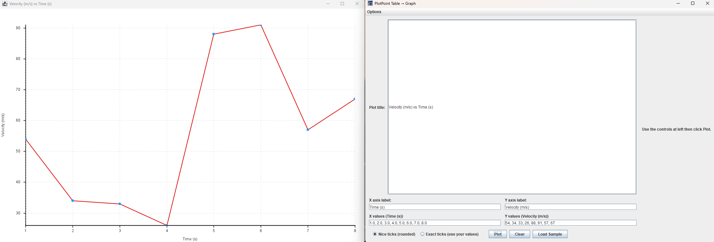

# PlotPoint

Simple x–y coordinate plotter for quick classroom or lab graphs. I was too lazy to use excel and decided to make this to graph out coordinates! 
Paste your **X** and **Y** values, pick **tick mode** (“Nice” rounded ticks or **Exact** ticks), label your axes, and hit **Plot** to instantly generate a graph.



---

## ✨ Features

- **Table → Graph in one window**
  - Text fields for X and Y lists (comma or space separated)
  - Sample data loader (Table 1 demo)
- **Two tick modes**
  - **Nice ticks**: rounded min/max and steps for clean, presentation-ready axes
  - **Exact ticks**: uses your raw values with no rounding
- **Live labels**
  - Typing in axis label fields automatically updates headers (e.g., typing `Time (s)` updates the X field label)
  - Custom plot title field
- **Resizable & responsive**
  - The graph expands or contracts smoothly as the window is resized
  - Extra spacing keeps the Y-axis label readable and away from tick marks
- **Flat-data padding**
  - When all Y values are the same, the graph auto-adds padding so the line doesn’t sit directly on the X-axis
- **Color customization**
  - Options menu to change line, point, grid, axis, tick, and background colors
---

## 🧠 How It Works

The program reads comma- or space-separated values from text areas, parses them into numeric arrays, and displays them in a resizable Swing-based plot window.

You can pick between **nice** (rounded) ticks and **exact** (raw) ticks.  
Axis and grid rendering are handled using `Graphics2D` for smooth antialiased drawing, and all labels auto-format using `DecimalFormat`.

---

## ⚙️ Quick Start

### 1️⃣ Compile

```bash
javac TableToGraph.java
```

### 2️⃣ Run

```bash
java TableToGraph
```

### 3️⃣ Input format

- **X values:** `1, 2, 3, 4, 5`
- **Y values:** `0.25, 0.50, 0.75, 1.00`
- Both lists must have the **same number of values** (≥ 2).

---

## 🧩 Build a Runnable JAR

```bash
# Compile
javac TableToGraph.java

# Package into JAR
jar cfe PlotPoint.jar TableToGraph *.class plotpoint.png plotpoint.ico

# Run it
java -jar PlotPoint.jar
```

---

## 📂 Repository Layout

```
.
├─ TableToGraph.java       # Main GUI + plotting logic
├─ plotpoint.png           # Window/taskbar icon (PNG)
├─ plotpoint.ico           # Optional Windows icon
└─ .gitignore
```

---

## 🚧 Future Enhancements

- CSV import support (drag & drop)
- Save/export plot as image (PNG)
- Multiple data series & legends
- Polynomial or linear regression overlay (y = mx + b)

---

## 🪪 License

MIT License (or your preferred license).  
Feel free to reuse, modify, and distribute.

---

## 🧑‍💻 Author

Created by **Moe Suleiman** ([@ms00l](https://github.com/ms00l))  
A learning-focused visualization tool for physics, kinematics, and data analysis.
